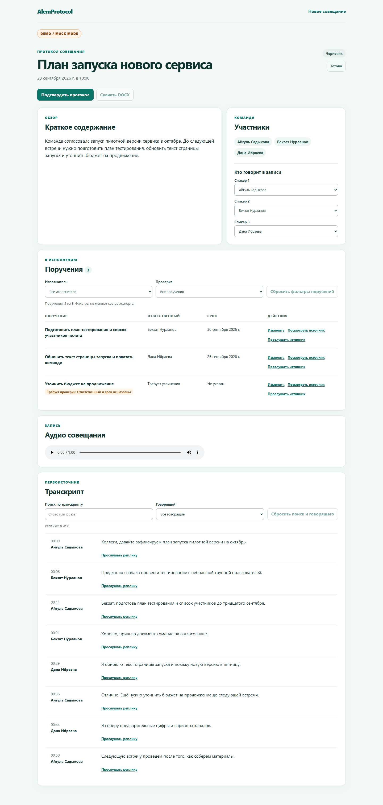
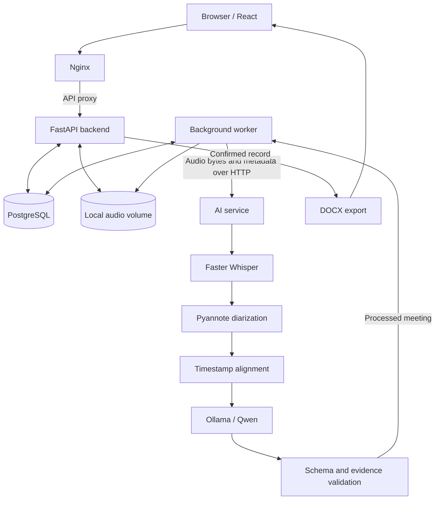

# AI Meeting Minutes

**Local AI Meeting Intelligence**

Turn meeting audio into a transcript, speaker-labelled discussion, structured summary and action items with traceable evidence. Faster Whisper, Pyannote and Ollama / Qwen run locally; FastAPI, PostgreSQL and React provide the processing queue, persistent review workflow and confirmed DOCX export.

The complete local CPU pipeline has been verified on short Russian audio excerpts. This is a working engineering project with measured limitations, not a claim of production readiness.

[Quick start](#quick-start) · [Model setup](#model-setup) · [Verification](docs/VERIFICATION.md) · [Deployment](docs/DEPLOYMENT.md)

## Demo



*The screenshot uses the repository's fictional demo fixture and is labelled DEMO / MOCK MODE. It illustrates the interface, not real inference quality. Private recordings and real-run screenshots are not distributed. The interface currently uses Russian and retains the original AlemProtocol branding.*

There is no hosted public demo. The quick start below runs locally.

## Features

- Upload WAV, MP3 or M4A with a meeting date, timezone and participant list.
- Read timestamped transcripts, detected speakers and a meeting summary.
- Review action items with responsible participants, deadlines, original date wording and source segments.
- Search the transcript; filter speakers and tasks by owner or review status.
- Jump from an action item to its evidence and play the corresponding audio. Source navigation reveals entries hidden by filters.
- Correct speaker mappings and tasks, save changes and reopen confirmed meetings for further review.
- Confirm a meeting and export the complete DOCX, regardless of active screen filters.
- Access account-scoped meeting history and original audio with HTTP Range support.
- Use cookie authentication, Argon2 password hashes and CSRF protection.
- Recover interrupted jobs using renewable leases, attempt fencing and bounded retries. Completed results and manual corrections are protected from reprocessing.

## Architecture



The worker stores validated results in PostgreSQL for review through the API. It sends audio bytes to the AI service, not a path on another machine. Real-model failures are explicit: the real profile does not fall back to mock output. Model setup needs network access; inference uses local weights and a local Ollama endpoint.

## AI Stack

| Stage | Model | Verified execution |
|---|---|---|
| Speech recognition | `Systran/faster-whisper-large-v3` | Faster Whisper, CPU / int8 |
| Speaker diarization | `pyannote/speaker-diarization-3.1` | CPU; segmentation-3.0 and wespeaker dependencies |
| Summary and action items | `qwen2.5:7b-instruct-q4_K_M` | Ollama 0.5.7, local inference |

Designed for local inference. Speaker identity, extracted tasks and deadlines still require human review. GPU execution and Kazakh / mixed-language accuracy are not established by the reported end-to-end runs.

## Tech Stack

| Layer | Tools |
|---|---|
| Frontend | React, TypeScript, Vite |
| Backend | Python 3.12, FastAPI, SQLAlchemy, Alembic, PostgreSQL 17.6 |
| AI | Faster Whisper, Pyannote, PyTorch, Ollama / Qwen, Pydantic |
| Infrastructure | Docker Compose, Nginx |
| Validation and export | pytest, Ruff, Oxlint, Playwright, python-docx |

Dependency versions are recorded in the service lockfiles and `frontend/package-lock.json`. Backend and AI use separate Python environments.

## Quick Start

Prerequisites: Git, Python 3.12 and Docker Engine with Compose v2, or Docker Desktop in Linux-container mode. Start with the explicit mock profile to explore the application without downloading models:

```bash
git clone https://github.com/alinur527/ai-meeting-minutes.git
cd ai-meeting-minutes
python scripts/init_env.py
docker compose --profile mock up -d --build
docker compose exec api python -m app.manage create-user --email owner@example.test --name Owner
```

On Windows, use `py -3.12` if `python` is unavailable; on Linux, use `python3.12`. Initialization creates fresh secrets in an ignored `.env` and refuses to overwrite an existing file. Account creation prompts for a password of at least 12 characters. There is no public signup.

Open [localhost:8088](http://localhost:8088). **The mock profile returns demonstration content and does not transcribe the uploaded audio.** Authentication, storage, queueing, HTTP transport, editing and DOCX export use the application services.

For real inference, complete model setup next. The validated environment allocated 11.54 GiB RAM and 20 CPU to Docker; memory observations are listed below. Allow substantial additional disk space for images and several gigabytes of weights. These observations are not a universal minimum hardware specification.

## Model Setup

Follow the [complete model setup commands](docs/DEPLOYMENT.md#real-ai-with-root-compose). They build the ML image, prepare the following Hugging Face repositories and pull the Qwen model into Ollama:

- [Faster Whisper large-v3](https://huggingface.co/Systran/faster-whisper-large-v3).
- [Pyannote speaker-diarization-3.1](https://huggingface.co/pyannote/speaker-diarization-3.1).
- [Pyannote segmentation-3.0](https://huggingface.co/pyannote/segmentation-3.0) and [wespeaker embeddings](https://huggingface.co/pyannote/wespeaker-voxceleb-resnet34-LM).
- `qwen2.5:7b-instruct-q4_K_M` through the Compose-managed Ollama service; no host Ollama installation is required.

Accept both gated Pyannote repositories' access conditions and supply a Hugging Face token only during setup. Do not commit that token. Once the cache is prepared, ASR / diarization can load offline; that loading path was checked with networking disabled. Ollama must remain reachable on the local container network.

After setup, stop `ai-mock` before enabling the real profile:

```bash
docker compose --profile mock stop ai-mock
docker compose -f compose.yml -f compose.real.yml --profile real up -d --build
```

The [prepared-stack helper](docs/DEPLOYMENT.md#reuse-a-prepared-local-stack), `python scripts/local_real.py start --build`, supports an existing standalone model installation. A fresh clone has no cache and must be prepared first.

## Configuration

These are the verified CPU settings; native defaults and Compose overrides are explained in the [AI guide](ai-service/README.md).

| Variable | Example / verified value | Purpose |
|---|---|---|
| `AI_MODE` | AI: `real`; backend: `http` | AI execution mode versus backend transport |
| `AI_EXPECTED_MODE` | `real` | Reject mismatched processing modes |
| `ASR_MODEL` | `Systran/faster-whisper-large-v3` | ASR checkpoint |
| `ASR_DEVICE`, `ASR_COMPUTE_TYPE` | `cpu`, `int8` | ASR execution |
| `DIARIZATION_MODEL` | `pyannote/speaker-diarization-3.1` | Speaker pipeline |
| `DIARIZATION_DEVICE` | `cpu` | Diarization execution |
| `OLLAMA_URL` | `http://ollama:11434` | Container-network LLM endpoint |
| `LLM_MODEL` | `qwen2.5:7b-instruct-q4_K_M` | Local language model |
| `LOW_MEMORY_MODE` | `1` | Unload models between stages |
| `MAX_AUDIO_MB`, `MAX_AUDIO_SECONDS` | `200`, `1800` | Upload and duration caps |
| `AI_INTERNAL_TOKEN` / `INTERNAL_TOKEN` | Generated secret | Backend-to-AI authentication |
| `FRONTEND_ORIGIN`, `COOKIE_SECURE` | Local URL, `false` for local HTTP | Session / origin configuration |

Root Compose sets service variables directly. Service `.env.example` files document native / standalone use; copying them does not override every root Compose setting. Never expose internal tokens through `VITE_*` variables.

## Usage

1. Upload a meeting recording and enter its date, timezone and participants.
2. Wait for `queued → running → completed`, or inspect the explicit failure message.
3. Review the transcript and map detected speakers to participants.
4. Check extracted action items against their transcript and audio evidence.
5. Correct uncertain owners, deadlines and wording; explicitly review unresolved fields.
6. Confirm the meeting and export DOCX. Reopen it before further edits.

## API Overview

Prefix these routes with `/api` when using the web proxy. The schema is available at [localhost:8088/api/openapi.json](http://localhost:8088/api/openapi.json); native backend development also exposes Swagger UI at `http://localhost:8080/docs`.

| Method / path | Purpose |
|---|---|
| `POST /auth/login`, `GET /auth/session`, `POST /auth/logout` | Cookie session lifecycle |
| `GET /capabilities` | Media limits and processing profile |
| `POST /meetings` | Multipart audio upload and meeting metadata |
| `GET /meetings`, `GET /meetings/{id}` | Account-scoped history and result |
| `PATCH /meetings/{id}/speakers` | Speaker mappings |
| `PATCH /meetings/{id}/tasks/{task_id}` | Task corrections / review |
| `POST /meetings/{id}/confirm`, `POST /meetings/{id}/reopen` | Review lifecycle |
| `POST /meetings/{id}/retry` | Retry an eligible failed meeting |
| `GET /meetings/{id}/audio` | Original audio with Range support |
| `GET /meetings/{id}/export?format=docx` | Confirmed DOCX |
| `GET /health`, `GET /ready` | Liveness and dependency readiness |

Mutations use Origin and CSRF checks; see the [frontend API client](frontend/src/api/meetings.ts). The AI service's internal `POST /internal/process` uses `X-Internal-Token` and is not exposed through the web proxy.

## Project Structure

```text
backend/                API, authentication, migrations, worker and DOCX
frontend/               React review interface and browser tests
ai-service/             Local ML pipeline and model preparation
shared/                 AI schemas and shared media contract
scripts/                Initialization, startup and verification helpers
docs/                   Deployment, evidence and product comparison
compose.yml             Application services and mock / real profiles
compose.real.yml        Enforce real AI results
compose.local-real.yml  Connect to a prepared standalone AI stack
```

## Verification

The September 29, 2026 baseline passed **40 backend tests, 44 AI tests and all 11 A/B checks**, including frontend lint / TypeScript / build, browser flows, HTTP mock integration and database / audio backup restoration. A/B uses explicit mocks or fakes and is separate from real inference.

Real Faster Whisper, Pyannote and Qwen were also exercised through the worker / API and a fresh browser upload, including persisted edits, confirmation and DOCX content checks. [Verification evidence](docs/VERIFICATION.md) distinguishes the original real-model runs from the public-copy validation. A GitHub Actions workflow is included; no unverified passing badge is displayed.

## Performance

| Real CPU run | Audio duration | Observed wall time | Result |
|---|---:|---:|---|
| Direct AI smoke | 35 s | 127.0 s | 2 segments, 2 speakers, summary, no tasks in the informational excerpt |
| API + worker | 40 s | 155.5 s | 7 segments, 2 speakers, 2 tasks; edits, confirmation and DOCX checked |
| Fresh browser upload | 40 s | 154.7 s | 7 segments, 2 speakers, 3 tasks; review workflow and DOCX checked |

**This is a local validation result, not a general benchmark.** Environment: Docker Desktop Linux / WSL2, 20 CPU allocated, 11.54 GiB Docker RAM, CPU / int8 and serial model stages. Point-in-time observations showed Ollama at approximately 8.4–8.9 GiB and the AI process at 0.4–0.5 GiB after unloading; continuous peak memory was not measured.

## Known Limitations

- Action-item extraction may vary between runs. The same 40-second audio produced two versus three tasks with different metadata IDs, even at temperature zero.
- Russian / Kazakh / mixed speech has not been fully benchmarked. WER / CER / DER were not formally measured.
- Long recordings need additional validation. The complete 274.25-second source recording was not processed end to end in the reported run.
- Uploads are capped at 200 MiB, 30 minutes and 200 participants. Serialized LLM input, including instructions and schema, is capped at 16,000 UTF-8 bytes, so speech-dense recordings may exceed this before the duration cap. Excess input fails explicitly rather than being silently truncated.
- Local large-model inference needs significant RAM. One inference runs at a time; throughput and sustained load are unmeasured.
- Ambiguous dates and unknown owners require human review. There is no transcript editing, team sharing, PDF export or cross-meeting task board yet.
- The project is not claimed to be production-ready. Public hosting and GPU compatibility require separate validation.

## Roadmap

- Improve extraction consistency and evaluate consented Russian / Kazakh / mixed-language meetings.
- Add evidence-preserving long-meeting chunking and measure resource usage.
- Add transcript revision history and structured decisions / risks.
- Explore external integrations after the review and audit workflow is stable.

## Documentation

- [Deployment, model setup and operations](docs/DEPLOYMENT.md)
- [Verification evidence and reproduction](docs/VERIFICATION.md)
- [Historical product comparison](docs/COMPETITIVE_ANALYSIS.md)
- [AI service documentation](ai-service/README.md)
- [Frontend development](frontend/README.md)
- [Two-computer setup](CONNECT_TWO_LAPTOPS.md) and [engineering history](docs/WORK_LOG.md)
- [Third-party acknowledgements](docs/THIRD_PARTY.md)

## Origin

Originally developed during the HackAlem AI Hackathon by team **Exit 1** and later completed and expanded into a working engineering project. The [original team repository](https://github.com/BAITC-Hacks/hack-bdffe61d-exit-1) is retained as historical attribution. This public repository starts a separate history from the current project files; it does not imply sole authorship of the team's earlier work.

## License

This project is licensed under the [MIT License](LICENSE). Copyright (c) 2026 Berdibek Alinur.

Dependencies and separately downloaded model weights retain their own licenses and access terms; the project's MIT License does not relicense them. See [third-party acknowledgements](docs/THIRD_PARTY.md).
